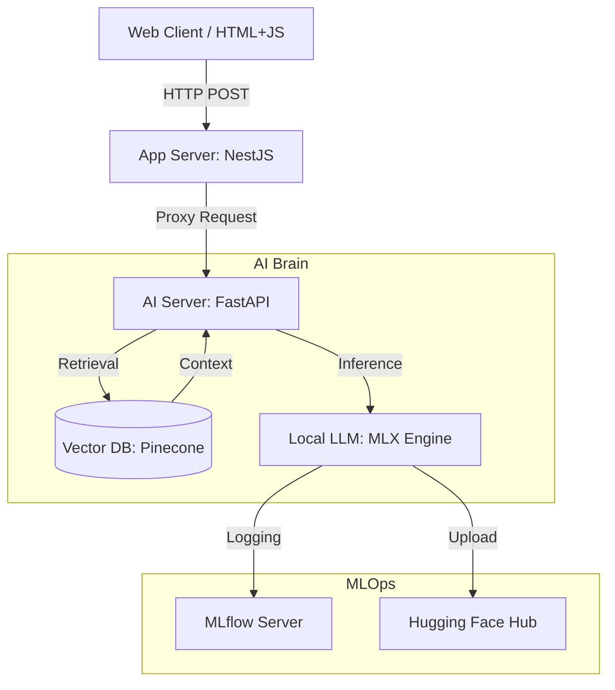

# Gemma Burger: AI-Powered Restaurant Concierge

> **Mac Silicon 기반의 로컬 LLM 추론과 RAG, Fine-tuning, MLOps를 결합한 하이브리드 AI 서비스**

## 1. 프로젝트 개요 (Overview)

**Gemma Burger**는 가상의 햄버거 가게에서 외국인 손님(사용자)의 영어 주문을 응대하는 AI 직원 챗봇 서비스입니다.
상용 API 비용을 최소화하고, **백엔드 엔지니어링(NestJS)**과 **AI 엔지니어링(Python/MLX)**의 장점을 결합한 **Hybrid Architecture**를 지향합니다.

### 핵심 목표

- **Local Inference:** Mac Apple Silicon(Metal) 가속을 활용한 로컬 LLM 구동 (비용 0원).
- **Hybrid Architecture:**
  - **NestJS:** 안정적인 API Gateway, 정적 파일 서빙, 트래픽 관리.
  - **Python:** RAG(지식 검색), 임베딩, LLM 추론, Fine-tuning 전담.
- **Advanced AI Engineering:**
  - **RAG:** Pinecone을 활용한 메뉴 지식 주입.
  - **Fine-tuning (LoRA):** "친절한 직원" 페르소나 주입.
  - **MLOps:** MLflow를 이용한 실험 관리 및 모델 레지스트리 구축.

---

## 2. 시스템 아키텍처 (System Architecture)

전체 시스템은 **Two-Tier Microservices** 구조를 따릅니다.



### 구성 요소별 역할

1.  **Application Server (NestJS)**

    - **API Gateway:** 클라이언트 요청을 받아 Python 서버로 중계.
    - **Frontend Hosting:** 채팅 UI (HTML/JS) 정적 서빙.
    - **Responsibility:** 인증, 로깅, 트래픽 제어 등 백엔드 본연의 업무 집중.

2.  **AI Server (Python/FastAPI)**

    - **RAG Engine:** LangChain + Pinecone을 사용하여 사용자 질문과 관련된 메뉴 정보 검색.
    - **Inference Engine:** Apple MLX 프레임워크를 사용하여 LLM(Gemma) 추론.
    - **Prompt Engineering:** 검색된 지식(Context)과 페르소나를 결합하여 프롬프트 조립.

3.  **Infra & MLOps**
    - **Pinecone:** 메뉴 데이터의 벡터 임베딩 저장소 (Serverless).
    - **MLflow (Docker):** 학습 파라미터 및 Loss 기록, 모델 아티팩트 관리.
    - **Hugging Face Hub:** 학습된 LoRA 어댑터 배포 및 공유.

---

## 3. 기술 스택 (Tech Stack)

| 구분             | 기술 (Technology)                    | 설명                               |
| :--------------- | :----------------------------------- | :--------------------------------- |
| **OS**           | macOS (Apple Silicon)                | Metal 가속 활용 (M1/M2/M3)         |
| **Backend**      | **NestJS** (Node.js v20+)            | Main Application & Gateway         |
| **AI Server**    | **FastAPI**, Uvicorn                 | AI Logic & Serving                 |
| **Model Engine** | **MLX-LM**, PyTorch                  | Apple Silicon 최적화 추론 및 학습  |
| **LLM**          | **mlx-community/gemma-3-4b-it-4bit** | 4-bit Quantized (Memory Efficient) |
| **RAG**          | **LangChain**, Sentence-Transformers | 오케스트레이션 및 임베딩           |
| **Vector DB**    | **Pinecone**                         | Vector Search (SaaS)               |
| **MLOps**        | **MLflow** (Docker), Hugging Face    | 실험 추적 및 모델 버전 관리        |

---

## 4. 디렉토리 구조 (Directory Structure)

```bash
gemma-burger/
├── app-server/          # NestJS Application (Gateway)
│   ├── src/
│   │   ├── chat/        # 채팅 중계 로직
│   │   └── main.ts
│   ├── public/          # Web UI (index.html)
│   └── package.json
├── model-server/        # Python AI Application (Brain)
│   ├── app/
│   │   ├── main.py      # FastAPI Entrypoint (RAG + Inference)
│   │   ├── engine.py    # MLX Model Loader & Generator
│   │   └── rag.py       # Pinecone Search Logic
│   ├── scripts/         # MLOps & Utility Scripts
│   │   ├── ingest.py    # 데이터 주입
│   │   ├── train_with_mlflow.py # LoRA 학습 및 MLflow 기록
│   │   └── upload_to_hub.py     # Hugging Face 업로드
│   ├── adapters/        # 학습된 LoRA 결과물
│   └── pyproject.toml   # Poetry Dependency
├── resources/           # 정적 데이터
│   ├── menu.json        # 메뉴 원본 데이터
│   └── fine_tuning/     # 학습용 데이터셋 (train.jsonl)
├── data/                # 로컬 데이터 (Docker Volumes, Logs)
├── docker-compose.yml   # MLOps 인프라 (MLflow)
└── README.md            # 프로젝트 문서
```

---

## 5. 실행 가이드 (Getting Started)

### 사전 요구사항 (Prerequisites)

- macOS (Apple Silicon 권장)
- Docker & Docker Compose
- Node.js (v20 LTS 권장)
- Python (v3.10+) & Poetry
- Pinecone API Key / Hugging Face Token

### 설치 및 실행 (Setup)

#### 1. 환경 변수 설정

`model-server/.env` 파일을 생성합니다.

```env
PINECONE_API_KEY=your_key
PINECONE_INDEX_NAME=gemma-burger
```

#### 2. MLOps 인프라 실행 (Docker)

MLflow 서버를 실행합니다.

```bash
docker-compose up -d
# 접속 확인: http://localhost:5001
```

#### 3. 모델 서버 설정 & 데이터 주입 (Python)

```bash
cd model-server
poetry install

# 1. 메뉴 데이터 Pinecone에 주입 (최초 1회)
poetry run python scripts/ingest.py

# 2. AI 서버 실행
poetry run uvicorn app.main:app --reload
```

#### 4. 앱 서버 실행 (NestJS)

```bash
cd ../app-server
npm install
npm run start:dev
```

#### 5. 접속

웹 브라우저에서 **`http://localhost:3000`** 접속 후 채팅 시작!

---

## 6. 개발 로드맵 (Completed Roadmap)

우리는 이 프로젝트를 통해 **AI 엔지니어링의 A to Z**를 경험했습니다.

### Phase 1: Baseline (기본 구축)

- [x] Python FastAPI 서버 구축 및 Gemma 모델(4bit) 로드.
- [x] NestJS 서버 구축 및 기본 웹 UI 연동.
- [x] 서버 간 HTTP 통신 연결.

### Phase 2: RAG (지식 주입)

- [x] `resources/menu.json` 데이터 정의.
- [x] **Pinecone** 벡터 DB 도입 (pgvector에서 변경).
- [x] Python 기반 RAG 엔진(`rag.py`) 구현 및 데이터 주입 스크립트 작성.
- [x] "없는 메뉴를 물어보면 정중히 거절하는" 로직 구현.

### Phase 3: Fine-tuning (페르소나 입히기)

- [x] Gemini를 활용한 고품질 합성 데이터(Synthetic Data) 생성.
- [x] **Apple MLX LoRA**를 활용한 로컬 파인튜닝 수행.
- [x] 학습된 Adapter(`adapters.safetensors`)를 런타임에 동적 로딩.
- [x] "Gemma Burger 직원 말투" 구현 성공.

### Phase 4: MLOps (관리 및 평가)

- [x] **MLflow** Docker 환경 구축 (Local Artifacts).
- [x] 학습 과정(Loss) 실시간 시각화 및 실험 기록.
- [x] **Hugging Face Hub**에 학습된 모델 업로드 및 배포.

### Phase 5: Advanced AI Service & UX (심화 기능 및 UX 개선)

- [ ] **Streaming Response (SSE)**

  - Python: `generate_step` 함수와 Generator를 활용하여 토큰 단위 생성 로직 구현.
  - NestJS: Python 서버의 스트림을 받아 클라이언트로 실시간 중계하는 SSE(Server-Sent Events) 로직 구현.
  - Frontend: `EventSource` API를 사용하여 답변이 실시간으로 작성되는 타이핑 효과 구현.

- [ ] **Structured RAG (Metadata Filtering)**

  - Data: 영업 시간, 매장 위치, 연락처 등 매장 운영 정보를 담은 `store_info.json` 데이터 추가.
  - Pinecone: 데이터 주입 시 `type` 메타데이터(예: menu, info)를 구분하여 저장.
  - Logic: 사용자 질문의 의도를 파악하여 적절한 메타데이터 필터를 적용하는 검색 로직 구현.

- [ ] **Multi-Agent System (Router & Persona)**

  - Persona: 불만 접수 및 규정 안내를 담당하는 매니저 에이전트(Gordon) 추가.
  - Router Chain: 사용자 입력의 성격(주문/잡담 vs 불만/심각)을 분류하여 적절한 에이전트에게 요청을 분배.

- [ ] **Agentic Tool Use (Budget Planner)**

  - **Goal:** "50달러 내로 추천해줘" 같은 요청 시, 예산에 맞춰 메뉴 조합(장바구니)을 구성.
  - Logic (Python): LLM이 직접 계산하지 않고, `recommend_menu_by_budget(limit)` 파이썬 함수(Tool)를 호출하도록 구현.
  - Algorithm: 냅색(Knapsack) 알고리즘이나 랜덤 조합 로직을 활용하여 예산을 꽉 채우는 세트 메뉴 구성 기능 개발.

- [ ] **Automated Evaluation (LLM-as-a-Judge)**
  - Pipeline: 대화 로그를 수집하고 외부 고성능 모델을 활용하여 답변 품질(정확성, 친절도)을 자동 채점하는 스크립트 작성.
  - MLflow: 채점 결과를 MLflow Metric으로 전송하여 모델 성능 변화를 정량적으로 모니터링.
