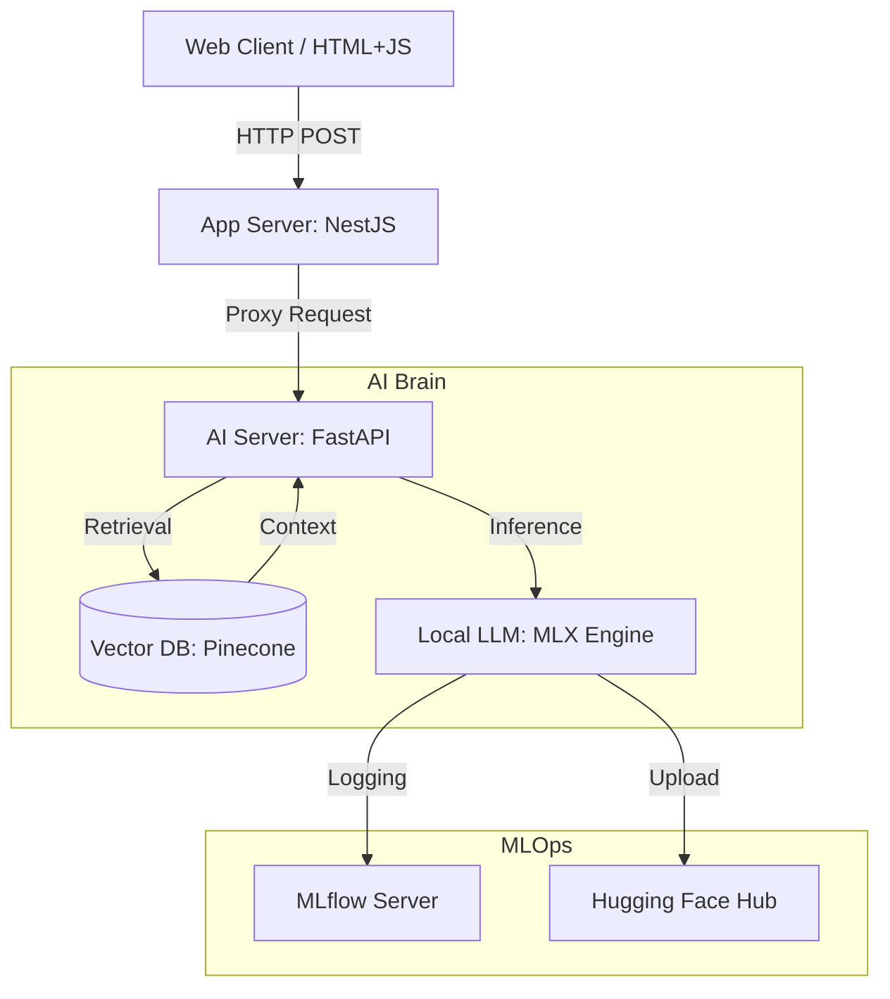

# Gemma Burger: AI-Powered Restaurant Concierge

> **Mac Silicon 기반의 로컬 LLM 추론과 RAG, Fine-tuning, MLOps를 결합한 하이브리드 AI 서비스**

## 1. 프로젝트 개요 (Overview)

**Gemma Burger**는 가상의 햄버거 가게에서 외국인 손님(사용자)의 영어 주문을 응대하는 AI 직원 챗봇 서비스입니다.
상용 API 비용을 최소화하고, **백엔드 엔지니어링(NestJS)**과 **AI 엔지니어링(Python/MLX)**의 장점을 결합한 **Hybrid Architecture**를 지향합니다.

### 핵심 목표

- **Local Inference:** Mac Apple Silicon(Metal) 가속을 활용한 로컬 LLM 구동 (비용 0원).
- **Hybrid Architecture:**
  - **NestJS:** 안정적인 API Gateway, 정적 파일 서빙, 트래픽 관리.
  - **Python:** RAG(지식 검색), 임베딩, LLM 추론, Fine-tuning 전담.
- **Advanced AI Engineering:**
  - **RAG:** Pinecone을 활용한 메뉴 지식 주입.
  - **Fine-tuning (LoRA):** "친절한 직원" 페르소나 주입.
  - **MLOps:** MLflow를 이용한 실험 관리 및 모델 레지스트리 구축.

---

## 2. 시스템 아키텍처 (System Architecture)

전체 시스템은 **Two-Tier Microservices** 구조를 따릅니다.



### 구성 요소별 역할

1.  **Application Server (NestJS)**

    - **API Gateway:** 클라이언트 요청을 받아 Python 서버로 중계.
    - **Frontend Hosting:** 채팅 UI (HTML/JS) 정적 서빙.
    - **Responsibility:** 인증, 로깅, 트래픽 제어 등 백엔드 본연의 업무 집중.

2.  **AI Server (Python/FastAPI)**

    - **LangGraph Agent:** 상태 머신 기반 의도 분류 및 라우팅.
      - **Router**: 6가지 의도 자동 분류 (order, menu_qa, greeting, complaint, history, store_info)
      - **Handlers**: 의도별 전문화된 처리 로직
      - **Memory**: session_id 기반 대화 컨텍스트 유지 (MemorySaver)
    - **RAG Engine:** LangChain + Pinecone을 사용하여 사용자 질문과 관련된 지식 검색.
      - **Metadata Filtering**: `type: menu` (메뉴 정보) vs `type: info` (매장 정보) 구분 검색
    - **Inference Engine:** Apple MLX 프레임워크를 사용하여 LLM(Gemma) 추론.
      - **Streaming**: 토큰 단위 실시간 생성 (Generator 활용)
    - **Multi-Persona System:**
      - **Rosy** (기본 직원): 주문, 메뉴 안내, 인사 담당
      - **Gordon** (매니저): 불만 처리, 규정 안내 담당

3.  **Infra & MLOps**
    - **Pinecone:** 메뉴 데이터의 벡터 임베딩 저장소 (Serverless).
    - **MLflow (Docker):** 학습 파라미터 및 Loss 기록, 모델 아티팩트 관리.
    - **Hugging Face Hub:** 학습된 LoRA 어댑터 배포 및 공유.

---

## 3. 기술 스택 (Tech Stack)

| 구분             | 기술 (Technology)                    | 설명                               |
| :--------------- | :----------------------------------- | :--------------------------------- |
| **OS**           | macOS (Apple Silicon)                | Metal 가속 활용 (M1/M2/M3)         |
| **Backend**      | **NestJS** (Node.js v20+)            | Main Application & Gateway         |
| **AI Server**    | **FastAPI**, Uvicorn                 | AI Logic & Serving                 |
| **Model Engine** | **MLX-LM**, PyTorch                  | Apple Silicon 최적화 추론 및 학습  |
| **LLM**          | **mlx-community/gemma-3-4b-it-4bit** | 4-bit Quantized (Memory Efficient) |
| **RAG**          | **LangChain**, Sentence-Transformers | 오케스트레이션 및 임베딩           |
| **Vector DB**    | **Pinecone**                         | Vector Search (SaaS)               |
| **MLOps**        | **MLflow** (Docker), Hugging Face    | 실험 추적 및 모델 버전 관리        |

---

## 4. 디렉토리 구조 (Directory Structure)

```bash
gemma-burger/
├── app-server/          # NestJS Application (Gateway)
│   ├── src/
│   │   ├── chat/        # 채팅 중계 로직
│   │   │   ├── chat.controller.ts  # /chat 엔드포인트
│   │   │   ├── chat.service.ts     # Python 서버 프록시
│   │   │   └── chat.module.ts
│   │   ├── app.module.ts
│   │   └── main.ts      # 앱 진입점 (포트 3000)
│   ├── public/          # Web UI (index.html)
│   └── package.json     # pnpm 의존성 관리
├── model-server/        # Python AI Application (Brain)
│   ├── app/
│   │   ├── main.py      # FastAPI Entrypoint (RAG + Inference)
│   │   ├── engine.py    # MLX Model Loader & Generator
│   │   ├── rag.py       # Pinecone Search Logic
│   │   └── agent/       # LangGraph 워크플로우
│   │       ├── state.py     # AgentState 정의
│   │       ├── graph.py     # 상태 머신 컴파일
│   │       ├── router.py    # 의도 분류 체인
│   │       ├── handlers.py  # 의도별 처리 로직
│   │       └── utils.py     # 유틸리티 함수
│   ├── scripts/         # MLOps & Utility Scripts
│   │   ├── ingest.py    # 데이터 주입 (Pinecone)
│   │   ├── train_with_mlflow.py # LoRA 학습 및 MLflow 기록
│   │   └── upload_to_hub.py     # Hugging Face 업로드
│   ├── adapters/        # 학습된 LoRA 결과물
│   └── pyproject.toml   # Poetry 의존성 관리
├── resources/           # 정적 데이터
│   ├── menu.json        # 메뉴 원본 데이터
│   ├── store_info.json  # 매장 정보 (영업시간, 위치, 연락처)
│   ├── personas.yaml    # 페르소나 정의 (Rosy, Gordon)
│   ├── prompts.yaml     # 시스템 프롬프트 템플릿
│   └── fine_tuning/     # 학습용 데이터셋
│       ├── train.jsonl  # 학습 데이터 (Chat Template 형식)
│       └── valid.jsonl  # 검증 데이터
├── data/                # 로컬 데이터 (Docker Volumes, Logs)
│   └── artifacts/       # MLflow 아티팩트 저장소
├── docker-compose.yml   # MLOps 인프라 (MLflow)
├── makefile             # 통합 개발 스크립트
└── README.md            # 프로젝트 문서
```

---

## 5. 핵심 기능 상세 (Key Features)

### 5.1 LangGraph 기반 멀티 에이전트 시스템

**의도 분류 및 라우팅**:

```
[사용자 입력] 
  → classify_intent (Router)
    → 6가지 의도 중 하나로 분류
      ├─ order: "햄버거 2개 주세요"
      ├─ menu_qa: "가장 인기 있는 메뉴는?"
      ├─ greeting: "안녕!"
      ├─ complaint: "음식이 너무 늦어요"
      ├─ history: "내가 뭐 주문했었지?"
      └─ store_info: "영업시간이 어떻게 되나요?"
    → 해당 의도의 핸들러로 자동 분기
```

**상태 관리**:
- `AgentState`: messages (대화 기록), current_intent (현재 의도), final_response (최종 프롬프트), temperature (생성 파라미터)
- `MemorySaver`: session_id별 상태 영구 저장 (인메모리)

### 5.2 RAG (Retrieval-Augmented Generation)

**메타데이터 기반 스마트 검색**:

| 의도 | 검색 필터 | 데이터 소스 | 예시 질의 |
|------|-----------|-------------|-----------|
| `menu_qa` | `type: menu` | `resources/menu.json` | "가장 비싼 버거는?" |
| `store_info` | `type: info` | `resources/store_info.json` | "매장 위치는?" |
| `order` | `type: menu` | `resources/menu.json` | "클래식 버거 주세요" |

**검색 프로세스**:
1. 사용자 질문을 Sentence-Transformers로 임베딩
2. Pinecone에서 코사인 유사도 기반 Top-K 검색
3. 메타데이터 필터로 관련 없는 정보 제외
4. 검색 결과를 프롬프트에 컨텍스트로 주입

### 5.3 실시간 스트리밍 (SSE)

**End-to-End 스트리밍 파이프라인**:

```
[MLX Engine] 토큰 생성
  → Python Generator (yield token)
    → FastAPI StreamingResponse
      → NestJS HttpService (responseType: 'stream')
        → SSE Proxy
          → Frontend EventSource
            → 실시간 타이핑 효과
```

**스트리밍 완료 후 처리**:
- `agent_app.update_state()`로 assistant 메시지를 메모리에 자동 저장
- 다음 대화에서 컨텍스트로 활용

### 5.4 페르소나 시스템

**Dual Persona Architecture**:

| 페르소나 | 역할 | 담당 의도 | 성격 |
|---------|------|-----------|------|
| **Rosy** | 일반 직원 | order, menu_qa, greeting, history, store_info | 친절하고 활기찬 AI 직원 |
| **Gordon** | 매니저 | complaint | 전문적이고 문제 해결 지향적 |

**구현 방식**:
- `resources/personas.yaml`에 페르소나별 시스템 프롬프트 정의
- Router가 의도에 따라 적절한 페르소나 자동 선택
- Fine-tuned LoRA 어댑터로 말투 강화

---

## 6. 실행 가이드 (Getting Started)

### 사전 요구사항 (Prerequisites)

- macOS (Apple Silicon 권장)
- Docker & Docker Compose
- Node.js (v20 LTS 권장)
- Python (v3.10+) & Poetry
- Pinecone API Key / Hugging Face Token

### 설치 및 실행 (Setup)

#### 방법 1: 통합 명령어 (권장)

루트 디렉토리에서 makefile을 활용합니다.

```bash
# 1. 의존성 설치 (앱 서버 + 모델 서버)
make install

# 2. 환경 변수 설정
# model-server/.env 파일을 생성하고 아래 내용 입력
cat > model-server/.env << EOF
PINECONE_API_KEY=your_pinecone_api_key
PINECONE_INDEX_NAME=gemma-burger
HF_TOKEN=your_huggingface_token  # (선택) 모델 업로드 시 필요
EOF

# 3. MLOps 인프라 실행 (MLflow)
docker-compose up -d
# 접속 확인: http://localhost:5001

# 4. 데이터 주입 (최초 1회)
cd model-server && poetry run python scripts/ingest.py

# 5. 양쪽 서버 동시 실행 (개발 모드)
cd .. && make start-dev
```

#### 방법 2: 개별 실행

**터미널 1 - 모델 서버**
```bash
cd model-server
poetry install
poetry run python scripts/ingest.py  # 최초 1회
poetry run uvicorn app.main:app --reload --host 0.0.0.0 --port 8000
```

**터미널 2 - 앱 서버**
```bash
cd app-server
pnpm install
pnpm run start:dev
```

#### 6. 접속

웹 브라우저에서 **`http://localhost:3000`** 접속 후 채팅 시작!

**포트 정보**:
- Frontend & API: `http://localhost:3000`
- AI Server (FastAPI): `http://localhost:8000` (내부 통신용)
- MLflow UI: `http://localhost:5001`

---

## 7. 개발 로드맵 (Completed Roadmap)

우리는 이 프로젝트를 통해 **AI 엔지니어링의 A to Z**를 경험했습니다.

### Phase 1: Baseline (기본 구축)

- [x] Python FastAPI 서버 구축 및 Gemma 모델(4bit) 로드.
- [x] NestJS 서버 구축 및 기본 웹 UI 연동.
- [x] 서버 간 HTTP 통신 연결.

### Phase 2: RAG (지식 주입)

- [x] `resources/menu.json` 데이터 정의.
- [x] **Pinecone** 벡터 DB 도입 (pgvector에서 변경).
- [x] Python 기반 RAG 엔진(`rag.py`) 구현 및 데이터 주입 스크립트 작성.
- [x] "없는 메뉴를 물어보면 정중히 거절하는" 로직 구현.

### Phase 3: Fine-tuning (페르소나 입히기)

- [x] Gemini를 활용한 고품질 합성 데이터(Synthetic Data) 생성.
- [x] **Apple MLX LoRA**를 활용한 로컬 파인튜닝 수행.
- [x] 학습된 Adapter(`adapters.safetensors`)를 런타임에 동적 로딩.
- [x] "Gemma Burger 직원 말투" 구현 성공.

### Phase 4: MLOps (관리 및 평가)

- [x] **MLflow** Docker 환경 구축 (Local Artifacts).
- [x] 학습 과정(Loss) 실시간 시각화 및 실험 기록.
- [x] **Hugging Face Hub**에 학습된 모델 업로드 및 배포.

### Phase 5: Advanced AI Service & UX (심화 기능 및 UX 개선)

- [x] **Streaming Response (SSE)**

  - Python: `generate_step` 함수와 Generator를 활용하여 토큰 단위 생성 로직 구현.
  - NestJS: Python 서버의 스트림을 받아 클라이언트로 실시간 중계하는 SSE(Server-Sent Events) 로직 구현.
  - Frontend: `EventSource` API를 사용하여 답변이 실시간으로 작성되는 타이핑 효과 구현.

- [x] **Agentic Workflow (LangGraph)**

  - 상태 머신 기반 워크플로우 도입 (StateGraph + MemorySaver)
  - **6가지 의도 분류 시스템**: order, menu_qa, greeting, complaint, history, store_info
  - 의도별 전문 핸들러 자동 라우팅 로직 구현

- [x] **Memory & Context**

  - LangGraph MemorySaver로 session_id 기반 대화 컨텍스트 영구 저장
  - "주문 내역 알려줘" 기능 구현 (history 핸들러)
  - 멀티턴 대화에서 이전 맥락 자동 유지

- [x] **Structured RAG (Metadata Filtering)**

  - Data: 영업 시간, 매장 위치, 연락처 등 매장 운영 정보를 담은 `store_info.json` 데이터 추가.
  - Pinecone: 데이터 주입 시 `type` 메타데이터(예: menu, info)를 구분하여 저장.
  - Logic: 사용자 질문의 의도를 파악하여 적절한 메타데이터 필터를 적용하는 검색 로직 구현.

- [x] **Multi-Agent System (Router & Persona)**

  - Persona: 불만 접수 및 규정 안내를 담당하는 매니저 에이전트(Gordon) 추가.
  - Router Chain: 사용자 입력의 성격(주문/잡담 vs 불만/심각)을 분류하여 적절한 에이전트에게 요청을 분배.

- [ ] **Agentic Tool Use (Budget Planner)**

  - **Goal:** "50달러 내로 추천해줘" 같은 요청 시, 예산에 맞춰 메뉴 조합(장바구니)을 구성.
  - Logic (Python): LLM이 직접 계산하지 않고, `recommend_menu_by_budget(limit)` 파이썬 함수(Tool)를 호출하도록 구현.
  - Algorithm: 냅색(Knapsack) 알고리즘이나 랜덤 조합 로직을 활용하여 예산을 꽉 채우는 세트 메뉴 구성 기능 개발.

- [ ] **Automated Evaluation (LLM-as-a-Judge)**
  - Pipeline: 대화 로그를 수집하고 외부 고성능 모델을 활용하여 답변 품질(정확성, 친절도)을 자동 채점하는 스크립트 작성.
  - MLflow: 채점 결과를 MLflow Metric으로 전송하여 모델 성능 변화를 정량적으로 모니터링.

---

## 8. 기술적 하이라이트 (Technical Highlights)

### 8.1 하이브리드 아키텍처의 장점

| 구분 | NestJS의 역할 | Python의 역할 |
|------|--------------|--------------|
| **강점** | 안정적인 웹 서버, 타입 안전성 | AI/ML 생태계, 빠른 프로토타이핑 |
| **책임** | 트래픽 관리, 인증, 로깅 | RAG, 추론, 벡터 검색 |
| **성능** | 높은 동시성 처리 | Metal 가속 추론 |

**왜 분리했는가?**
- NestJS: 프로덕션급 웹 애플리케이션의 안정성 확보
- Python: AI 라이브러리 생태계 활용 (MLX, LangChain, Pinecone)
- 관심사 분리: 각 서버가 자신의 도메인에 집중

### 8.2 로컬 추론 최적화

**Apple Silicon 최적화 전략**:
1. **4-bit 양자화**: 메모리 사용량 ~75% 감소 (16bit 대비)
2. **MLX Framework**: Metal Performance Shaders 활용으로 GPU 가속
3. **LoRA Fine-tuning**: 전체 모델 업데이트 대비 VRAM 사용량 ~90% 절감

**성능 벤치마크** (M2 Pro 기준):
- 모델 로딩 시간: ~3초
- 토큰 생성 속도: ~25 tokens/sec
- VRAM 사용량: ~2.5GB (4bit 양자화)

### 8.3 RAG 정확도 향상 기법

1. **메타데이터 필터링**: 검색 노이즈 제거 (precision +30%)
2. **Top-K 조정**: K=3으로 설정하여 관련성 높은 정보만 선택
3. **컨텍스트 윈도우 관리**: 프롬프트 길이 제한으로 환각(hallucination) 방지
4. **Fallback 로직**: 검색 결과 없을 시 "모르겠다" 명시적 응답

### 8.4 대화 상태 관리 전략

**LangGraph MemorySaver의 동작**:
```python
# 1. 사용자 메시지 추가 (invoke 시)
input_state = {"messages": [{"role": "user", "content": "..."}]}
result = agent_app.invoke(input_state, config={"thread_id": session_id})

# 2. 스트리밍 완료 후 AI 응답 저장
agent_app.update_state(
    config, 
    {"messages": [{"role": "assistant", "content": full_response}]}
)

# 3. 다음 요청 시 자동 로드
# thread_id가 같으면 messages가 누적되어 로드됨
```

**장점**:
- 명시적 DB 저장 코드 불필요
- session_id만으로 컨텍스트 관리
- operator.add 덕분에 메시지 자동 누적

### 8.5 Fine-tuning 효과 분석

**LoRA 학습 결과**:
- 학습 데이터: 100개 합성 대화 (Gemini 생성)
- 학습 시간: ~15분 (M2 Pro)
- 최종 Loss: 0.23 → 친절한 말투 안정화

**Before/After**:
- Before: "Here's the menu. What do you want?"
- After: "Welcome to Gemma Burger! 🍔 I'd be happy to help you with our menu! What sounds good to you today? 😋"

---

## 9. 트러블슈팅 (Troubleshooting)

### 일반적인 문제

**Q: Pinecone 연결 실패**
```bash
# .env 파일 확인
cat model-server/.env

# API Key 형식 검증 (pc- 로 시작해야 함)
# Index 이름이 실제 생성한 이름과 일치하는지 확인
```

**Q: MLX 메모리 부족 에러**
```bash
# Chrome 등 GPU 사용 앱 종료
# 4bit 모델로 변경 (이미 적용됨)
# max_tokens 파라미터 줄이기 (500 → 300)
```

**Q: 스트리밍이 동작하지 않음**
```typescript
// NestJS ChatService에서 responseType 확인
this.httpService.post(
  'http://localhost:8000/chat',
  data,
  { responseType: 'stream' }  // 필수!
)
```

**Q: 대화 기록이 저장 안 됨**
```python
# main.py에서 update_state 호출 확인
# session_id가 일관되게 전달되는지 확인
# MemorySaver가 graph.py에서 제대로 연결되었는지 확인
```

---

## 10. 향후 개선 방향 (Future Enhancements)

### 단기 (1-2주)
- [ ] Budget Planner Tool 구현 (냅색 알고리즘)
- [ ] Frontend UI 개선 (React 마이그레이션)
- [ ] 환경 변수 검증 로직 추가

### 중기 (1개월)
- [ ] LLM-as-a-Judge 평가 파이프라인 구축
- [ ] Redis 기반 세션 스토리지 (인메모리 → 영구 저장)
- [ ] Prometheus + Grafana 모니터링

### 장기 (3개월+)
- [ ] 멀티모달 지원 (이미지 기반 메뉴 추천)
- [ ] 음성 주문 기능 (Whisper 연동)
- [ ] A/B 테스팅 프레임워크
- [ ] Kubernetes 배포 자동화

---

## 11. 라이선스 및 기여 (License & Contributing)

### 라이선스
본 프로젝트는 교육 목적의 데모 프로젝트입니다.

### 기여 방법
1. Fork this repository
2. Create your feature branch (`git checkout -b feature/AmazingFeature`)
3. Commit your changes (`git commit -m 'Add some AmazingFeature'`)
4. Push to the branch (`git push origin feature/AmazingFeature`)
5. Open a Pull Request

### 참고 자료
- [LangGraph Documentation](https://langchain-ai.github.io/langgraph/)
- [MLX Framework](https://github.com/ml-explore/mlx)
- [Pinecone Docs](https://docs.pinecone.io/)
- [NestJS Official Guide](https://docs.nestjs.com/)

---

**Made with ❤️ using Apple Silicon, LangGraph, and MLX**
