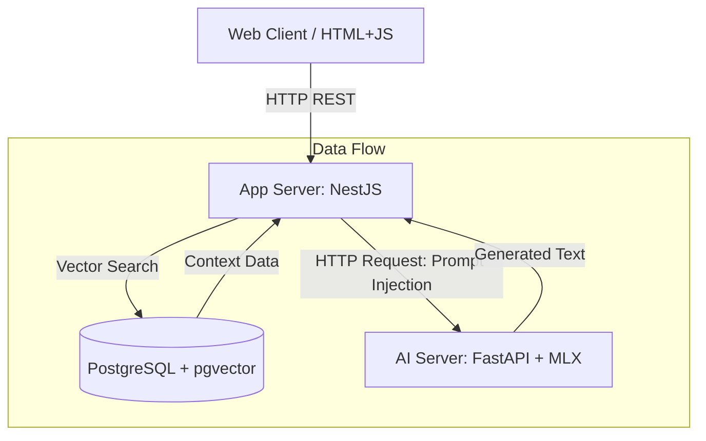

# 🍔 Gemma Burger: AI-Powered Restaurant Concierge

> **Mac Silicon 기반의 로컬 LLM 추론과 RAG, Fine-tuning을 활용한 영어 회화 주문 서비스**

## 1. 프로젝트 개요 (Overview)

**Gemma Burger**는 가상의 햄버거 가게에서 외국인 손님(사용자)의 영어 주문을 응대하는 AI 직원 챗봇 서비스입니다.  
클라우드 API 비용 없이 **100% 로컬 환경(On-Device)**에서 동작하며, 백엔드 엔지니어링과 AI 엔지니어링의 모범적인 결합(Hybrid Architecture)을 목표로 합니다.

### 🎯 핵심 목표

- **Zero Cost:** 상용 API(OpenAI, Bedrock 등)를 사용하지 않고 로컬 모델 구동.
- **Mac Optimization:** Apple MLX 라이브러리를 활용한 GPU 가속 추론.
- **Hybrid Engineering:**
  - **NestJS:** 비즈니스 로직, RAG(Vector Search), 데이터 관리.
  - **Python:** 순수 AI 추론(Inference) 엔진 역할.
- **Full AI Lifecycle:** 데이터 구축 → 모델 서빙 → RAG 구현 → Fine-tuning(LoRA) → MLOps 경험.

---

## 2. 시스템 아키텍처 (System Architecture)

전체 시스템은 **Two-Tier Microservices** 구조를 따릅니다.



### 🏗️ 구성 요소별 역할

1.  **Application Server (Node.js/NestJS)**

    - 사용자 트래픽 처리 및 API Gateway 역할.
    - **RAG (Retrieval-Augmented Generation):** 사용자 질문을 벡터화하여 DB에서 관련 메뉴 정보를 검색.
    - **Prompt Engineering:** 검색된 정보(Context)와 페르소나를 조합하여 프롬프트 생성.
    - 채팅 로그 저장 및 관리.

2.  **Inference Server (Python/FastAPI)**

    - **Stateless AI Engine:** 비즈니스 로직 없이 오직 `Input Text -> LLM -> Output Text` 수행.
    - **MLX-LM:** Apple Silicon에 최적화된 고속 추론 서빙.

3.  **Database (PostgreSQL)**
    - **pgvector:** 메뉴 설명 및 지식 데이터의 벡터 임베딩 저장.
    - 일반 관계형 데이터(주문 기록, 채팅 로그) 저장.

---

## 3. 기술 스택 (Tech Stack)

| 구분             | 기술 (Technology)             | 설명                                   |
| :--------------- | :---------------------------- | :------------------------------------- |
| **OS**           | macOS (Apple Silicon)         | Metal 가속 활용 환경                   |
| **Frontend**     | HTML5, JavaScript             | NestJS Static Serving (Simple Chat UI) |
| **Backend**      | **NestJS**, TypeORM           | Main Application Framework             |
| **AI Server**    | **FastAPI**, Uvicorn          | Model Serving API                      |
| **Model Engine** | **MLX-LM**, Hugging Face      | Apple Silicon 최적화 추론 및 학습      |
| **LLM**          | **google/gemma-3-4b-it-4bit** | 4-bit Quantized (Memory Efficient)     |
| **Database**     | **PostgreSQL** + **pgvector** | RDB & Vector DB Hybrid                 |
| **DevOps**       | Docker, Docker Compose        | Container Orchestration                |
| **MLOps**        | MLflow                        | Experiment Tracking (Fine-tuning Loss) |

---

## 4. 디렉토리 구조 (Directory Structure)

```bash
gemma-burger/
├── app-server/          # NestJS Application
│   ├── src/
│   │   ├── chat/        # 채팅 비즈니스 로직
│   │   ├── rag/         # Vector Search 로직
│   │   └── database/    # Entity & Repository
│   ├── public/          # Frontend Static Files (HTML)
│   └── package.json
├── model-server/        # Python AI Application
│   ├── app/
│   │   ├── main.py      # FastAPI Entrypoint
│   │   └── engine.py    # MLX Model Loader
│   ├── models/          # 로컬 모델 저장소 (Gemma-3 weights)
│   ├── pyproject.toml   # Poetry Dependency
│   └── Dockerfile
├── data/                # 데이터셋 및 초기화 스크립트
│   ├── menu.json        # 메뉴 원본 데이터
│   ├── vector_init.sql  # DB 초기화 SQL
│   └── fine_tuning/     # 학습용 데이터셋
├── docker-compose.yml   # 전체 서비스 실행 설정
└── README.md            # 프로젝트 문서
```

---

## 5. 실행 가이드 (Getting Started)

### 사전 요구사항 (Prerequisites)

- macOS (M1 이상 권장)
- Docker & Docker Compose
- Node.js (v22+) & npm
- Python (v3.10+) & Poetry

### 🚀 설치 및 실행 (Setup)

#### 1. 프로젝트 클론

```bash
git clone [https://github.com/suites/gemma-burger.git](https://github.com/suites/gemma-burger.git)
cd gemma-burger
```

#### 2. 모델 서버 설정 (Python)

```bash
cd model-server
poetry install

brew install huggingface-cli
```

env 설정

```bash
# 모델 다운로드 (HuggingFace CLI 활용) 또는 실행 시 자동 다운로드
poetry run uvicorn app.main:app --reload
```

#### 3. 앱 서버 설정 (NestJS)

```bash
cd ../app-server
npm install
npm run start:dev
```

#### 4. 전체 실행 (Docker Compose)

```bash
# 루트 디렉토리에서
docker-compose up --build
```

---

## 6. 개발 로드맵 (Roadmap)

### Phase 1: Baseline (기본 구축)

- [x] Python FastAPI 서버 구축 및 Gemma-3-4b-it-4bit 로드.
- [x] NestJS 서버 구축 및 Python 서버와 HTTP 통신 연결.
- [x] 기본 채팅 UI 구현 및 "Hello" 테스트.

### Phase 2: RAG (지식 주입)

- [x] `menu.json` 데이터 정의.
- [x] PostgreSQL `pgvector` 설정 및 메뉴 데이터 임베딩/저장.
- [x] NestJS에서 사용자 질문에 따른 메뉴 검색 로직 구현.

### Phase 3: Fine-tuning (페르소나 입히기)

- [x] LLM을 활용한 합성 데이터(Synthetic Data) 50쌍 생성.
- [x] MLX LoRA를 활용하여 "친절한 직원" 말투 학습.
- [x] 학습된 Adapter를 Python 서버에 적용.

### Phase 4: MLOps (관리 및 평가)

- [x] MLflow 연동하여 학습 Loss 시각화.
- [x] 파인튜닝 전/후 응답 퀄리티 비교 평가.
